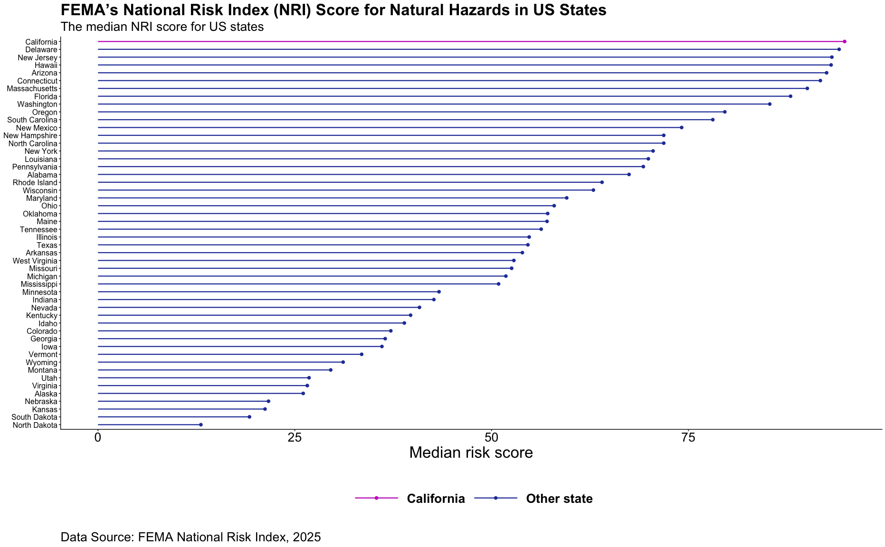

# HW 2: Visualizing FEMA NRI Data

This repository contains the details of the Assignment 2 for the course EDS 240 - Data Visualization & Communication for the Master of Environmental Data Science (MEDS) program.

## Background

The Federal Emergency Management Agency (FEMA) is a U.S. government agency whose mission is to help people prepare for, respond to, and recover from disasters. In 2021, FEMA launched the National Risk Index (NRI), a nationwide dataset designed to help communities understand and compare their risk from natural hazards.

The NRI provides risk information for 18 different natural hazards at the census tract and county levels. It offers a standardized baseline measure of risk by combining three core components: Expected Annual Loss, Social Vulnerability, and Community Resilience. Together, these components capture both the physical impacts of hazards and the social conditions that influence a community’s ability to prepare for and recover from disasters.

The NRI reports both hazard-specific risk scores and a composite risk score, which aggregates risk across all 18 hazard types. Each community’s score is expressed as a percentile ranking relative to other communities at the same geographic level. In addition, communities are assigned a qualitative risk rating ranging from very low to very high, to facilitate interpretation and comparison.

In December 2025, FEMA integrated the National Risk Index into the Resilience Analysis and Planning Tool (RAPT), expanding access to NRI data and supporting its use in resilience planning, policy analysis, and community-level decision-making.



## Objective

The objective of this assignment is to explore FEMA’s National Risk Index (NRI) data and identify visualization approaches that are most appropriate for both the data and intended audience. The assignment focuses on preparing and wrangling the data to ensure it is properly structured for visualization, and on building effective, responsible, accessible, and aesthetically pleasing visualizations using the R programming language—primarily with `{ggplot2}` and related extension packages.

## Repository Structure

```
eds240-nri-acs-viz
└─── .gitignore
└─── README.md
└─── eds240-nri-acs-viz.Rproj
└─── HW2.pdf
└─── HW2.qmd
└─── image
     └─── fema-nri-cali.png

```

## Data

This assignment uses data from FEMA’s National Risk Index (NRI), an interactive dataset that provides risk information for 18 natural hazards across U.S. communities. The NRI includes county and census tracts level measures of expected annual loss, social vulnerability, community resilience, and overall Risk Index scores that describe relative natural hazard risk. (FEMA Hazards)

The full data set and interactive tools are available [here](https://experience.arcgis.com/experience/0a317e8998534c30a9b2d3861c814d42/).

## References
Federal Emergency Management Agency. (2021). *National Risk Index for natural hazards.* https://experience.arcgis.com/experience/0a317e8998534c30a9b2d3861c814d42/

### Course Information

- **Course Title:** [EDS 240 - Data Visualization & Communication](https://eds-240-data-viz.github.io/)
- **Term:** Winter 2026
- **Program:** [UCSB Masters in Environmental Data Science](https://bren.ucsb.edu/masters-programs/master-environmental-data-science).

Teaching Team:

- **Instructor:** [Sam Shanny-Csik](https://samanthacsik.github.io/)
- **Co-Instructor:** [Annie Adams](https://github.com/annieradams) 

Complete description for this assignment can be found on [Assignment 2](https://eds-240-data-viz.github.io/course-materials/assignments/HW2.html).
